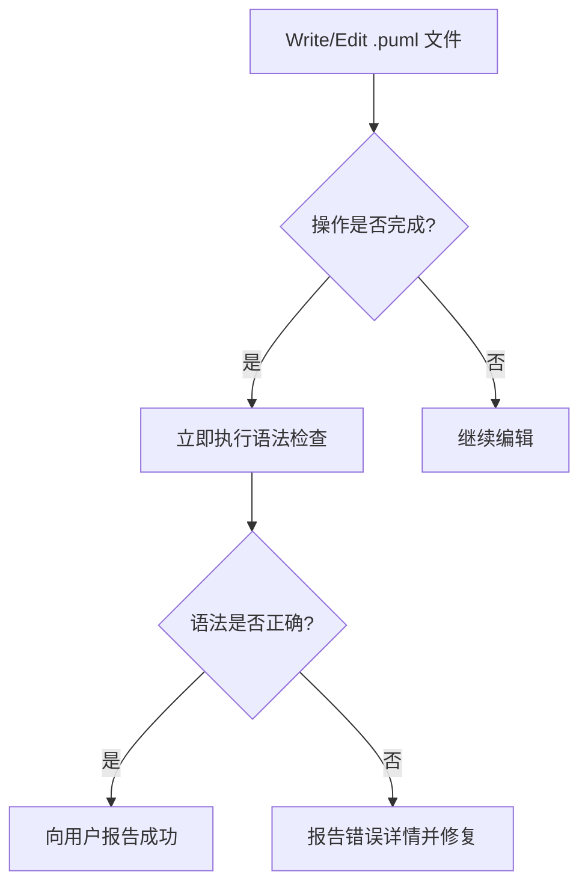

# PlantUML 语法检查器

## 概述

在编写或修改图表文件后，必须立即验证 PlantUML 语法。这可以防止语法错误传播到文档、CI/CD 流水线或下游渲染流程中。

## 何时使用



**图例说明**：Write/Edit 操作完成后必须立即进行语法检查，检查失败需报告错误详情。

**以下情况必须检查：**
- 创建新的 `.puml` 或 `.plantuml` 文件
- 编辑现有的 PlantUML 图表文件
- 修改图表结构、参与者或关系
- 批量操作多个 PlantUML 文件

**使用 Docker 检查（推荐）：**
```bash
docker run --rm -v $(pwd):/data plantuml/plantuml -check /data/diagram.puml
```

## 快速参考

| 场景 | 命令 |
|------|------|
| 单个文件 | `docker run --rm -v $(pwd):/data plantuml/plantuml -check /data/file.puml` |
| 多个文件 | 遍历 `*.puml` 逐个检查 |
| 不同目录 | 相应调整 `-v` 路径和 `/data/` 前缀 |

## 错误解读

| 退出码 | 含义 |
|-------|------|
| 0（无输出） | 语法正确 ✓ |
| 非零且有输出 | 语法错误 ✗ - 输出显示行号和问题 |

**错误输出示例：**
```
Error line 3 in file: /data/diagram.puml
Some diagram description contains errors
```

## 警示信号 - 立即检查

- "文件看起来没问题"
- "这只是个简单的图表"
- "用户没有要求验证"
- "稍后再检查"
- "跳过验证节省时间"

**出现任何一种想法，都必须：立即执行语法检查。**

## 常见错误

| 错误 | 修正方法 |
|------|---------|
| 未使用 `-v` 挂载卷 | 始终使用 `-v $(pwd):/data` |
| 路径前缀错误 | 挂载文件使用 `/data/` 前缀 |
| 文件不存在就检查 | 在 Write/Edit 完成后再检查 |
| 忽略退出码 | 非零退出码 = 错误，需向用户报告 |
