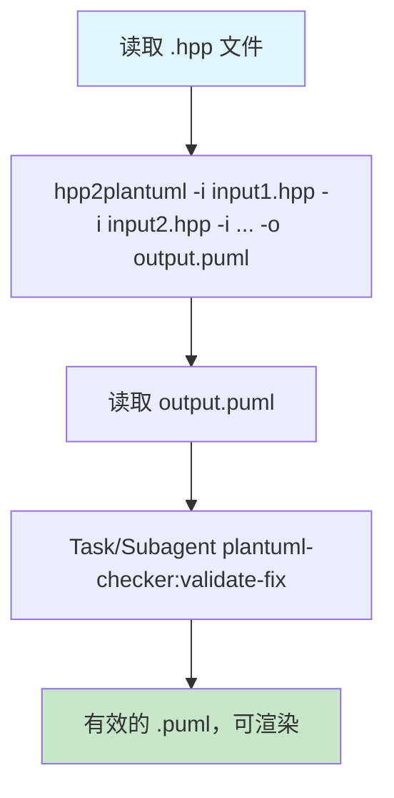

# PlantUML 创建器

## 概述
使用 hpp2plantuml 从 C++ 头文件生成 PlantUML，然后使用 plantuml-checker 验证/修复语法。确保图表能正确渲染，无需手动调试。

## 何时使用
- 将 .hpp/.H等C++头文件转换为 .puml（例如：代码库分析、文档生成）


**图例：** 利用hpp2plantuml创建PlantUML文件流程，从头文件到验证后的输出。

## 实现步骤
1. 生成（CLI 示例，使用项目测试）：
```bash
hpp2plantuml -i input1.hpp -i input2.hpp -o test_diagram.puml 
```
预期输出：`@startuml ... class Class01 ... @enduml`

2. 验证/修复：
```
在 Write 后调用 Task/Subagent plantuml-checker：
- description: "验证并修复 PlantUML 语法"
- prompt: "检查生成的 diagram.puml 是否有 PlantUML 错误。如果无效，使用 Edit 自动修复。"
```

